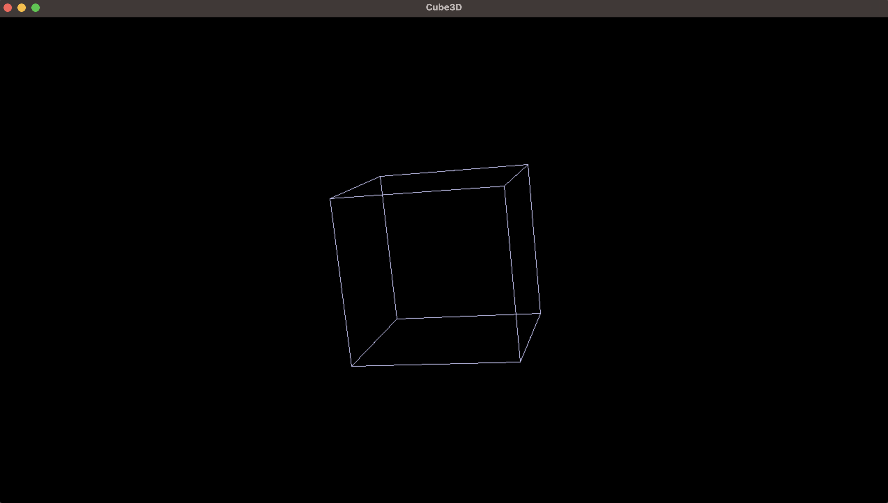
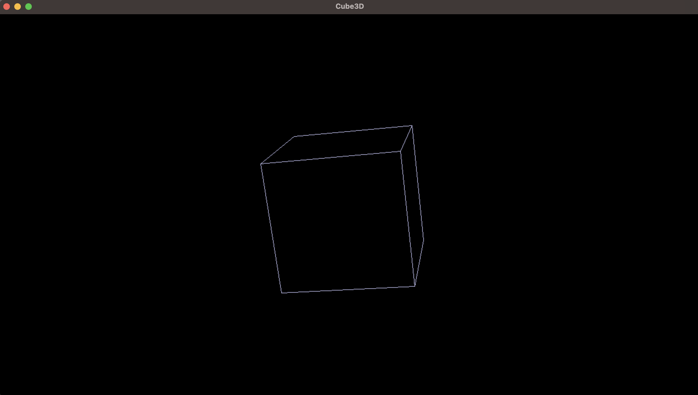
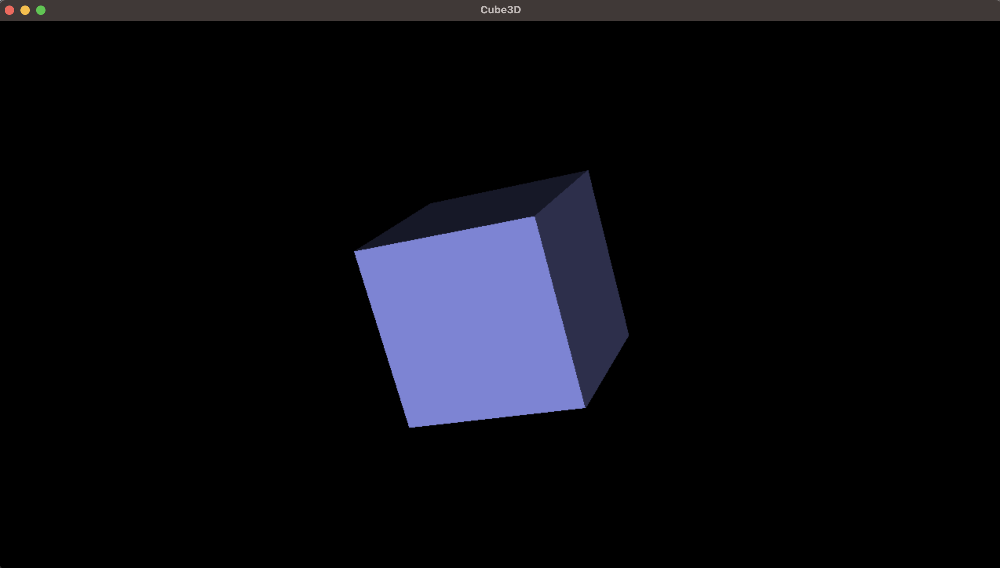

# 🧊 Cube-3D
**Cube3D** is a simple 3D cube viewer and renderer implemented in C using the SDL2 library. It demonstrates fundamental concepts of 3D graphics including projection, face culling, rotation, and lighting, all possible via extensive linear algebra and trigonometry 

## ✨ Features
- Perspective projection
- Mouse-controlled 3D rotation
- Back-face culling toogle (`c` key)
- Solid face rendering toggle (`f` key)
- Dynamic lighting via dot product
- Resizable SDL window

## 📷 Preview

Cube3D with back-face culling off and solid face rendering off


Cube3D with back-face culling on and solid face rendering off


Cube3D with back-face culling on and solid face rendering on

## 🛠️ Build Instructions
### Requirements
 - SDL2
 - GCC or any C compiler

### Compilation
```bash
Make
```

### Run
```bash
./Cube3D
```

## Controls
| Key/Input | Action                   |
|-----------|--------------------------|
| `f`       | toggle filled face mode
| `c`       | toggle back-face culling
